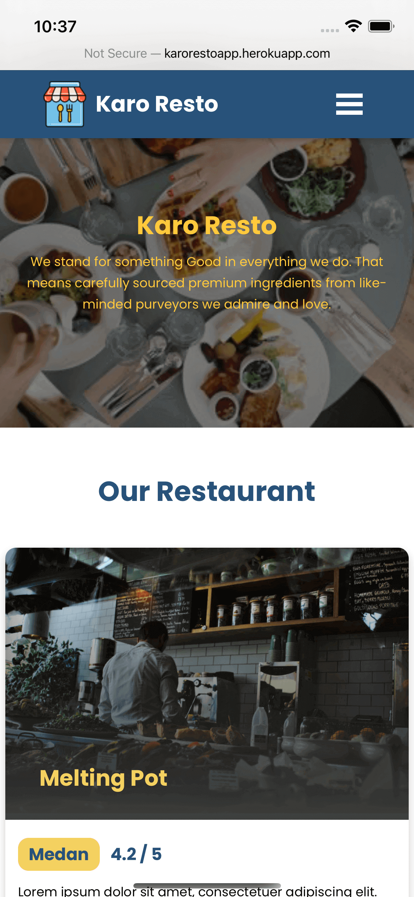
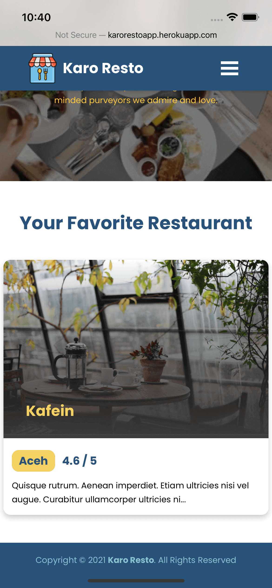

# Learned Menjadi Front-End Web Developer Expert Academy Dicoding

This repository is all about learning to build Restaurant Apps using Progressive Web Apps from [API Dicoding](https://restaurant-api.dicoding.dev).

Screenshots
-----------
<p align="center">
  
  
  
</p>
<br>
<br>

Libraries Used
--------------
* [Progressive Web Apps][0] - Web apps that use emerging web browser APIs and features along with traditional progressive enhancement strategy to bring a native app-like user experience to cross-platform web applications.
* [Webpack][1] - A static module bundler for modern JavaScript applications.
* [Eslint][2] - Find and fix problems in your JavaScript code.
* [IndexedDB][3] - A way for you to persistently store data inside a user's browser.
* [Karma][4] - To bring a productive testing environment to developers.
* [CodeceptJS][5] - A modern end to end testing framework with a special BDD-style syntax.
* [file-loader][6] - Resolves import/require on a file into a url and emits the file into the output directory.
* [Sharp][7] - The typical use case for this high speed Node.js module is to convert large images in common formats to smaller, web-friendly JPEG, PNG, AVIF and WebP images of varying dimensions.
* [Workbox Webpack Plugins][8] - Workbox provides two webpack plugins: one that generates a complete service worker for you and one that generates a list of assets to precache that is injected into a service worker file.
* [Imagemin][9] - Minify images seamlessly.
* [Lazysizes][10] - High performance and SEO friendly lazy loader for images (responsive and normal), iframes and more, that detects any visibility changes triggered through user interaction, CSS or JavaScript without configuration.
* [Regenerator Runtime][11] - Source transformer enabling ECMAScript 6 generator functions in JavaScript-of-today.
* [Express][12] - A minimal and flexible Node.js web application framework that provides a robust set of features for web and mobile applications.
* [Webpack Bundle Analyzer][13] - Webpack plugin and CLI utility that represents bundle content as convenient interactive zoomable treemap.

[0]: https://developers.google.com/web/progressive-web-apps
[1]: https://webpack.js.org
[2]: https://eslint.org
[3]: https://developer.mozilla.org/en-US/docs/Web/API/IndexedDB_API/Using_IndexedDB
[4]: https://karma-runner.github.io/latest/index.html
[5]: https://codecept.io
[6]: https://v4.webpack.js.org/loaders/file-loader/
[7]: https://sharp.pixelplumbing.com
[8]: https://developers.google.com/web/tools/workbox/modules/workbox-webpack-plugin
[9]: https://github.com/imagemin/imagemin
[10]: https://github.com/aFarkas/lazysizes
[11]: https://github.com/facebook/regenerator
[12]: https://expressjs.com
[13]: https://github.com/webpack-contrib/webpack-bundle-analyzer

Noted
--------------------
Please use this as a reference only. Hope this helps you develop more projects.

License
--------------------
```
Copyright (C) 2020 Alfa Centaury Hidayatullah

   Licensed under the Apache License, Version 2.0 (the "License");
   you may not use this file except in compliance with the License.
   You may obtain a copy of the License at

       http://www.apache.org/licenses/LICENSE-2.0

   Unless required by applicable law or agreed to in writing, software
   distributed under the License is distributed on an "AS IS" BASIS,
   WITHOUT WARRANTIES OR CONDITIONS OF ANY KIND, either express or implied.
   See the License for the specific language governing permissions and
   limitations under the License.
```